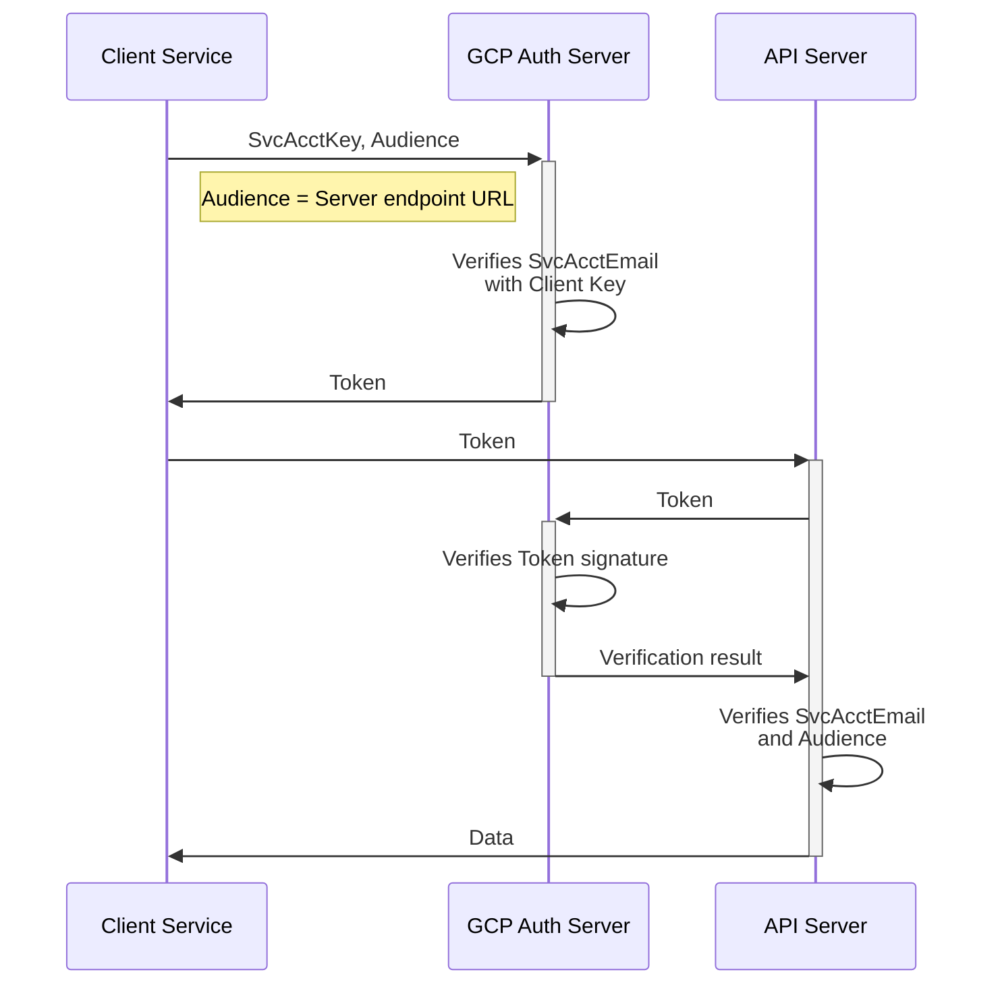

## Introduction

You can learn from this guide how to use OAuth via a Google server to:

- [connect to Settle](Connecting_to_Settle.md)
- [accept connections from Settle](Accepting_connections_from_Settle.md)

We are using Google Cloud Platform (GCP) service accounts and
authorization servers to secure endpoints in our APIs.

We propose that you use the same principles to secure endpoints in your APIs.

After reading the docs for how to connect, consider taking a look at
[the Python demo for the entire flow](python_demo.md).

## The OAuth flow

This is a generic diagram that applies in both directions, i.e. for both
connecting to settle and for accepting connections from Settle.
Please refer back to this for clarity on terminology and discrete steps
if any confusion arises while reading the other docs.

